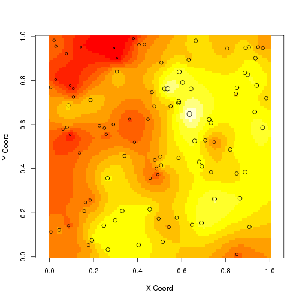

```{r setup, include=FALSE}
options(htmltools.dir.version = FALSE)
knitr::opts_chunk$set(fig.bg = function(before, options, envir) {
  if (before) par(bg = options$fig.bg)
})
```

# Sumário

1. Tipologia dos dados espaciais
2. Estrutura de dados
3. Mapas com R base
3. Mapas com `ggplot2`
4. Pacote: `leaflet`

---
class: inverse, center, middle

# Introdução
---
background-image: url(figuras/why-r.png)

# Why R?

---

background-image: url(figuras/quem-usa-r.png)
# Quem usa R?

---

background-image: url(figuras/r-integracao.png)
# Integração

---

# Motivação

- Exemplos de mapas interativos.


---

# Motivação

.pull-left[
```{r ex1-leaflet, eval=TRUE, fig.height=4, include=TRUE, out.width='100%'}
library(leaflet)
data(quakes)
head(quakes)
```

```{r ex2-leaflet, eval=FALSE, fig.height=4, include=TRUE, out.width='100%'}
leaflet(data = quakes[1:20,]) %>% 
  addTiles() %>%
  addMarkers(lng = ~long, 
             lat = ~lat, 
             popup = ~mag), 
             label = ~mag)
```
]

.pull-right[
```{r ex1-leaflet-run, echo=FALSE, fig.height=6.5, out.width='100%'}
library(leaflet)
data(quakes)

leaflet(data = quakes[1:20,]) %>% 
  addTiles() %>%
  addMarkers(~long, ~lat, popup = ~as.character(mag), label = ~as.character(mag))
```
]

---
# Referência

.pull-left[

]

.pull-right[
- Capítulo 5: Spatial Analysis
  - Spatial Analysis and GIS
  - Spatial Objects in R
  - Maps in R
  - Reading Maps and Data in R
  - Exploratory Spatial Data Analysis
  - Testing for Spatial Correlation
  - Spatial Car Accident Insurance Analysis
  - Spatial Car Accident Insurance Shared Analysis
]

---
# Referência

.pull-left[
<br><br><br><br>
<center>

</center>
]

.pull-right[
- Simple Features for R: Standardized Support for Spatial Vector Data
  - Autor: Edzer Pebesma
  - https://r-spatial.github.io/sf/
]

---

# Pacotes: análise e visualização

- **`sp`**: classes e métodos para dados espaciais;
- **`sf`**: (Simple Features) classes mais modernas para dados espaciais;
- **`maptools`**, **`rgdal`**: leitura, gravação e manipulação de dados espaciais
- **`spdep`**: regressão espacial, taxa Bayesianas, Índice de Moran, correlação espacial, matriz de vizinhança.
- **`leaflet`**, **`spGoogle`**, **`maps`**: visualização de dados georreferenciados.

Para mais detalhes pode acessar a página [Task View: Analysis of Spatial Data](https://CRAN.R-project.org/view=Spatial)

---
class: inverse, center, middle

# Tipologia de dados espaciais
---

# Dados de Processos Pontuais

- Conjunto de dados em que o principal interesse está no conjunto de coordenadas geográficas (pontos) que representam as localizações exatas dos eventos.

  - Exemplos: local de acidentes de carros, residências de indivíduos doentes, locais de onde os usuários do Twitter postaram.


```{r mapa-acidente, echo=FALSE, fig.cap='', fig.align='center', fig.height=5, fig.width=5, message=FALSE, warning=FALSE}
require(sf)
si <- read.csv2('~/Downloads/si-bol_2015.csv', encoding = 'latin1')
si$coordenada_x <- as.numeric(as.character(si$coordenada_x))/100
si$coordenada_y <- as.numeric(as.character(si$coordenada_y))/100
si <- subset(si, coordenada_x != 0)
pts <- st_multipoint(x = as.matrix(si[, c('coordenada_x', 'coordenada_y')])) %>%
  st_sfc() %>%
  st_cast('POINT') %>%
  st_set_crs("+init=epsg:29193")

par(mar = rep(0, 4), bg = 'transparent')
plot(st_geometry(pts), pch = 19, col = '#BBBBBB22')
```

---

# Dados de Processos Pontuais

```{r mapa-acidente-ex1, echo=TRUE, fig.align='center', fig.cap='', fig.height=5, fig.width=5, message=FALSE, warning=FALSE, eval=FALSE, size='tiny'}
require(sf)
si <- read.csv2('~/Downloads/si-bol_2015.csv', encoding = 'latin1')
pts <- st_multipoint(x = as.matrix(si[, c('coordenada_x', 'coordenada_y')])) %>%
  st_sfc() %>%
  st_cast('POINT') %>%
  st_set_crs("+init=epsg:29193")

par(mar = rep(0, 4), bg = 'transparent')
plot(st_geometry(pts), pch = 19, col = '#BBBBBB22')
```

```{r mapa-acidente-ex2, echo=FALSE, fig.cap='Mapa', fig.align='center', fig.height=4.5, fig.width=5, message=FALSE, warning=FALSE}
require(sp)
si <- read.csv2('~/Downloads/si-bol_2015.csv', encoding = 'latin1')
si$coordenada_x <- as.numeric(as.character(si$coordenada_x))
si$coordenada_y <- as.numeric(as.character(si$coordenada_y))
si <- subset(si, coordenada_x != 0)
pts <- SpatialPointsDataFrame(coords = si[, c('coordenada_x', 'coordenada_y')], data = si, proj4string = CRS("+init=epsg:29193"))
par(mar = rep(0, 4), bg = 'transparent')
plot(pts, pch = 19, col = '#BBBBBB22')
```

---
# Dados de Superfícies Aleatórias

- Existe uma área amplamente desenvolvida para análise de dados de superfíceis aleatórias: *geoestatística*. 

  - Exemplos: temperatura, acidez de solo, ph da água do rio.

<center>

</center>  

---
# Dados de Área

- Este tipo de dado geralmente pode ser visualizado em mapas onde o espaço é particionado em  áreas e cada área é colorida de acordo com alguma variável.
  - Exemplos: número de votos de um determinado candidato a presidência por UF, renda média por setor censitário, número de médicos por bairro.
  
```{r mapa-uf-ex1, echo=FALSE, fig.align='center', fig.height=5, message=FALSE, warning=FALSE, out.width='100%'}
data(rio, package = 'spGoogle')
library(leaflet)
bins <- c(0, 1, 2, 3, 4, 5, Inf)
pal <- colorBin("YlOrRd", domain = rio$SMR, bins = bins)

leaflet(rio) %>%
  addProviderTiles(providers$OpenStreetMap.Mapnik) %>%
  addPolygons(fillColor = ~pal(SMR), 
              weight = 1.5,
              opacity = 1,
              fillOpacity = 0.7,
              color = "gray",
              highlight = highlightOptions(
    weight = 5,
    color = "#666",
    # dashArray = "",
    fillOpacity = 0.7,
    bringToFront = TRUE),
    label = sprintf("%s - SMR: %s", rio$Name, round(rio$SMR, 3)),
    labelOptions = labelOptions(
    style = list("font-weight" = "normal", padding = "3px 8px"),
    textsize = "15px",
    direction = "auto")) %>%
  addLegend(pal = pal, values = ~SMR, opacity = 0.7, title = 'SMR',
  position = "bottomright")
```

---
class: inverse, center, middle

# Estrutura de dados espaciais

---
# Estrutura de dados espaciais

<br><br><br><br><br><br>
<center>
.large[Dados espaciais nada mais é que um conjunto de pontos indexados.]
</center>

---
# Padrão ESRI (ArcGis): shapefiles

- `shapefile` formato popular para armazenamento de dados espaciais proposto pela ESRI;
- O conjunto de arquivos é obrigatoriamente composto por:
  - `.shp.`: coordenadas geográficas.
  - `.shx`: índices que ligam as coordenadas geográficas aos seus atributos
  - `.dbf`: tabela de atributos.

---
# GeoJSON/TopoJSON

- É um formato que comporta classes de objetos espacias mais genéricas.

```
{
  "type": "Feature",
  "geometry": {
    "type": "Point",
    "coordinates": [125.6, 10.1]
  },
  "properties": {
    "name": "Dinagat Islands"
  }
}
```
---
class: inverse, center, middle

# sf: Simple Features

---
# sf: tipos de mapas

- Mapa de áreas $\rightarrow$ **`st_polygon/st_multipolygon`**
- Mapa de pontos $\rightarrow$ **`st_point/st_multipoint`**
- Mapa de linhas $\rightarrow$ **`st_linestring/st_multilinestring`**

---
# sf: tipos de mapas

```{r echo=FALSE, message=FALSE, warning=FALSE, fig.align='center', paged.print=FALSE, prompt=TRUE}
p <- rbind(c(3.2,4), c(3,4.6), c(3.8,4.4), c(3.5,3.8), c(3.4,3.6), c(3.9,4.5))
mp <- st_multipoint(p)
s1 <- rbind(c(0,3),c(0,4),c(1,5),c(2,5))
ls <- st_linestring(s1)
s2 <- rbind(c(0.2,3), c(0.2,4), c(1,4.8), c(2,4.8))
s3 <- rbind(c(0,4.4), c(0.6,5))
mls <- st_multilinestring(list(s1,s2,s3))
p1 <- rbind(c(0,0), c(1,0), c(3,2), c(2,4), c(1,4), c(0,0))
p2 <- rbind(c(1,1), c(1,2), c(2,2), c(1,1))
pol <-st_polygon(list(p1,p2))
p3 <- rbind(c(3,0), c(4,0), c(4,1), c(3,1), c(3,0))
p4 <- rbind(c(3.3,0.3), c(3.8,0.3), c(3.8,0.8), c(3.3,0.8), c(3.3,0.3))[5:1,]
p5 <- rbind(c(3,3), c(4,2), c(4,3), c(3,3))
mpol <- st_multipolygon(list(list(p1,p2), list(p3,p4), list(p5)))
gc <- st_geometrycollection(list(mp, mpol, ls))
par(mar = c(0.1, 0.1, 1.3, 0.1), mfrow = c(2, 3))
plot(mp, col = 'red')
box()
title("MULTIPOINT")

plot(ls, col = 'red')
box()
title("LINESTRING")

plot(mls, col = 'red')
box()
title("MULTILINESTRING")

plot(pol, border = 'red', col = 'grey', xlim = c(0,4))
box()
title("POLYGON")

plot(mpol, border = 'red', col = 'grey')
box()
title("MULTIPOLYGON")

plot(gc, border = 'grey', col = 'grey')
box()
title("GEOMETRYCOLLECTION")
par(mfrow = c(1, 1))
```

---
class: inverse, center, middle

# Meu primeiro mapa.

---
# R base

- Não existe uma classe no R base para dados espaciais.
- Pacote `sp`: primeiro pacote que formaliza as classes e estrutura de dados espaciais no R. 
- Pacote `sf`: a modernização do pacote `sp`, com o tempo o pacote `sp` será descontinuado. - Focamos apenas no pacote `sf`.

---
# R base

```{r message=FALSE, warning=FALSE, cache=T, fig.align='center',fig.height=5/1.618, fig.width=5, fig.bg='transparent', dpi=150}
require(sf)
rs_sf <- st_read('rs_sf.shp', quiet = T) # shapefile disponibilizado pelo IBGE
par(mar = rep(0, 4), bg = 'transparent')
plot(st_geometry(rs_sf), col = 'steelblue', border = 'gray90')
```
---
# R base

```{r message=FALSE, warning=FALSE, cache=T, fig.align='center', fig.height=4, fig.width=4}
head(rs_sf)
```

---
# R base

```{r message=FALSE, warning=FALSE, cache=T, fig.align='center', fig.height=6, fig.width=7}
distancia <- st_distance(subset(rs_sf, NOME == "Porto Alegre"), rs_sf)
rs_sf$distancia <- distancia[1, ]
par(mar = rep(0, 4), bg = 'transparent')
plot(rs_sf['distancia'], main = "Distância para PoA")
```

---
# Ler/Escrever dados espaciais

- Primeiro precisamos dos shapefile ou do arquivo que contém os pontos que formam o nosso objeto espacial. 

- `st_read`: função para leitura dos daods
  - `dsn`: caminho do arquivo ou do banco de dados.
- `st_write`: função para gravar o objeto final

```{r message=FALSE, warning=FALSE, cache=T, fig.align='center', fig.height=4, fig.width=4}
require(sf)
rs_sf <- st_read('rs_sf.shp', quiet = T)
head(rs_sf, 3)
```

---
# Ler/Escrever dados espaciais

- `rs_sf` é tratado como um data.frame, ou seja, podemos relizar filtros, criar novas variáveis, etc.

```{r message=FALSE, warning=FALSE, cache=T, fig.align='center', fig.height=4, fig.width=4}
class(rs_sf)
class(rs_sf$geometry)
pa_sf <- subset(rs_sf, NOME == "Porto Alegre")
st_write(pa_sf, dsn = 'pa_sf.shp', quiet = F, delete_dsn = T)
```

---
class: inverse, center, middle

# Cores

---
# Escolha de cores

- `RColorBrewer`: http://colorbrewer2.org
- https://color.adobe.com
- `colors()`
- `terrain.colors()`
- `topo.colors`
- `sf.colors`
- Qualquer outra cor usando RBG.

---
# Variável contínua

```{r message=FALSE, warning=FALSE, cache=T,fig.width=5, fig.height=5/1.618,fig.align='center'}
rio <- st_read(dsn = 'rio_sf.shp', quiet = T)
par(mar = rep(0, 4), bg = 'transparent')
plot(rio['Income'], # variável a ser visualizada
     axes = TRUE,   # apresentar os eixos no gráfico
     key.pos = 4,   # posição da legenda
     breaks = 'quantile', # tipo de quebra da variável
     nbreaks = 5,         # número de quebras
     pal = sf.colors(5),  # paleta de cores
     key.width = lcm(2.5)) # larguea da legenda
```

---
# Variável contínua
```{r message=FALSE, warning=FALSE, cache=T, fig.width=5, fig.height=5/1.618, fig.align='center'}
par(mar = rep(0, 4), bg = 'transparent')
plot(rio['Income'], 
     axes = TRUE, 
     key.pos = 1,
     breaks = c(0, .2, .4, .6, .8, 1), # quebras customizadas
     pal = RColorBrewer::brewer.pal(n = 5, 'Blues'), # usando RColorBrewer
     key.width = lcm(2.5))
```

---
# Variável categórica

- Usando a funçãot `mutate` do pacote `dplyr`.

```{r message=FALSE, warning=FALSE, cache=T, fig.width=5, fig.height=5/1.618, fig.align='center'}
library(dplyr)
rio <- rio %>%
  mutate(risco = cut(SMR, breaks = c(0, 1, 1.5, Inf), 
                     labels = c('Baixo', 'Médio', 'Alto')))

plot(rio['risco'], 
     axes = TRUE, 
     key.pos = 1,
     pal = c('lightgreen', 'orange', 'darkred'))
```

---
# Vários mapas

```{r message=FALSE, warning=FALSE, cache=T, fig.width=5, fig.height=5/1.618, fig.align='center'}
library(dplyr)
rio <- rio %>%
  mutate(risco = cut(SMR, breaks = c(0, 1, 1.5, Inf), 
                     labels = c('Baixo', 'Médio', 'Alto')))
par(mfrow = c(1, 2))
plot(rio[c('Urban', 'Income')])
```
---
class: inverse, center, middle

# ggplot2

---
# ggplot2

- `ggplot2` é um dos pacotes do R mais utilizados para criação de gráficos visualmente agradáveis.
- Exemplos: https://ggplot2.tidyverse.org/
- Neste tutorial iremos usar uma nova função do pacote `geom_sf`.

---
# ggplot2

```{r eval=FALSE, fig.align='center', fig.height=5/1.618, fig.width=5, message=FALSE, warning=FALSE, cache=T, include=T}
library(ggplot2)
rio_pts <- rio %>%
  as.data.frame() %>%
  mutate(Long = as.numeric(as.character(Long)),
         Lat = as.numeric(as.character(Lat))) %>%
  st_as_sf(coords = c("Long", "Lat"), crs = st_crs(rio))

ggplot() +
  geom_sf(data = rio, aes(fill = 1000*Dengue/Pop)) +
  geom_sf(data = rio_pts, aes(size = Urban, color = Urban)) +
  scale_fill_continuous(low = "lightblue", high = "darkblue") +
  theme_minimal()
```
---
# ggplot2

```{r echo=FALSE, fig.align='center', fig.height=8/1.618, fig.width=8, message=FALSE, warning=FALSE, cache=T, paged.print=FALSE}
library(ggplot2)
rio_pts <- rio %>%
  as.data.frame() %>%
  mutate(Long = as.numeric(as.character(Long)),
         Lat = as.numeric(as.character(Lat))) %>%
  st_as_sf(coords = c("Long", "Lat"), crs = st_crs(rio))

ggplot() +
  geom_sf(data = rio, aes(fill = 1000*Dengue/Pop)) +
  geom_sf(data = rio_pts, aes(size = Urban, color = Urban)) +
  scale_fill_continuous(low = "lightblue", high = "darkblue") +
  theme_minimal()

```

---
class: inverse, center, middle

# leaflet

---
# leaflet

- É um pacote `open-source` baseado em bibliotecas JavaScript para construção de mapas interativos;
- Utilizado pelo **The New York Times** para criação de mapas;
- As visualização são rendenrizadas no OpenSteetMap.
- Para instalar o pacote, bastar rodar o comando abaixo.

```{r  eval=FALSE, prompt=TRUE}
install.packages("leaflet")
library(leaflet) # ou require(leaflet)
```

---
# Exemplos: pontos

```{r fig.align='center', fig.height=5, out.width='100%', message=FALSE, warning=FALSE}
library(leaflet)
latlong_rede <- readRDS("dados/lat_long_rede_atendimento.rds")
leaflet() %>%
  addTiles() %>%
  addMarkers(lng=latlong_rede$lng, lat=latlong_rede$lat)
```

---
# Exemplos: pontos

```{r echo=FALSE, fig.align='center', fig.height=5, message=FALSE, warning=FALSE}
library(leaflet)
latlong_rede <- readRDS("dados/lat_long_rede_atendimento.rds")
latlong_rede <- latlong_rede[!duplicated(latlong_rede$ID), ]
rede_unimed <- readRDS("dados/rede-atendimento-unimed.rds")
latlong_rede <- cbind(latlong_rede, rede_unimed)
```

```{r fig.align='center', fig.height=5, out.width='100%', message=FALSE, warning=FALSE}
library(leaflet)
leaflet() %>%
  addTiles() %>%
  addMarkers(lng=latlong_rede$lng,
             lat=latlong_rede$lat,
             popup = latlong_rede$razao_social, 
             label = latlong_rede$tipo)
```

---
# Exemplos: heatmap 

```{r fig.align='center', fig.height=5, out.width='100%', message=FALSE, warning=FALSE}
library(leaflet.extras)
leaflet(quakes) %>% 
  addProviderTiles(providers$CartoDB.DarkMatter) %>%
  setView( 178, -20, 5 ) %>%
  addHeatmap(lng = ~long, lat = ~lat, intensity = ~mag,
             blur = 20, max = 0.05, radius = 15)
```

---
# Exemplos: polygons 

```{r echo=TRUE, eval=FALSE, fig.align='center', fig.height=5, message=FALSE, warning=FALSE, out.width='100%', include=TRUE}
data(rio)
bins <- c(0, 1, 2, 3, 4, 5, Inf)
pal <- colorBin("YlOrRd", domain = rio$SMR, bins = bins)

leaflet(rio) %>%
  addProviderTiles(providers$OpenStreetMap.Mapnik) %>%
  addPolygons(fillColor = ~pal(SMR), 
              weight = 1.5,
              opacity = 1,
              fillOpacity = 0.7,
              color = "gray",
               highlight = highlightOptions(
    weight = 5,
    color = "#666",
    dashArray = "",
    fillOpacity = 0.7,
    bringToFront = TRUE),
    label = sprintf("%s - SMR: %s", rio$Name, round(rio$SMR, 3)),
    labelOptions = labelOptions(
    style = list("font-weight" = "normal", padding = "3px 8px"),
    textsize = "15px",
    direction = "auto")) %>%
  addLegend(pal = pal, values = ~SMR, opacity = 0.7, title = NULL,
  position = "bottomright")
```

---
# Exemplos: polygons 

```{r echo=FALSE, fig.align='center', fig.height=5, message=FALSE, warning=FALSE, out.width='100%'}
data(rio)
bins <- c(0, 1, 2, 3, 4, 5, Inf)
pal <- colorBin("YlOrRd", domain = rio$SMR, bins = bins)

leaflet(rio) %>%
  addProviderTiles(providers$OpenStreetMap.Mapnik) %>%
  addPolygons(fillColor = ~pal(SMR), 
              weight = 1.5,
              opacity = 1,
              fillOpacity = 0.7,
              color = "gray",
               highlight = highlightOptions(
    weight = 5,
    color = "#666",
    fillOpacity = 0.7,
    bringToFront = TRUE),
    label = sprintf("%s - SMR: %s", rio$Name, round(rio$SMR, 3)),
    labelOptions = labelOptions(
    style = list("font-weight" = "normal", padding = "3px 8px"),
    textsize = "15px",
    direction = "auto")) %>%
  addLegend(pal = pal, values = ~SMR, opacity = 0.7, title = NULL,
  position = "bottomright")
```

---
class: inverse, center, middle
# Conclusão

---
# Conclusão

- Os pacotes `spGoogle` e `leaflet` produzem mapas interativos de forma simples e intuitiva;

- Tantos os pacotes quanto o software `R` são **open-source**, ou seja, não nenhum custo ao utilizar estas ferramentas;

- Com poucas linhas de código é possível customizar os mapas em um padrão da empresa;

- Estes mapas podem ser integrados em aplicações Web, por exemplo, aplicativos `Shiny`.

---
class: inverse, center, middle
# Obrigado
lgsilvaesilva@gmail.com


